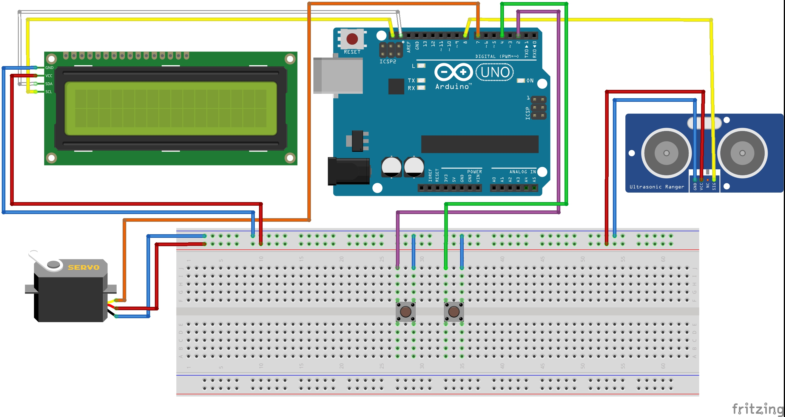

# Barrier Gate

Barrier Gate is a project created using arduino. It is a scaled version of real life barrier gate.

## How It Works

1. LCD display presents you with initial message. Here you can select if you already have a ticket.
2. If you selected `yes`, you will be moved to verification stage. This feature is not implemented in this project so you can select `button1` to progress or `button2` to go back.
3. If you selected `no`, you will be moved to ticket purchase page. This feature is also not implemented and follows the same approach as previous step.
4. If you pressed button1 during step 2 or 3, you will be moved to verification stage. Press `button1` to progress or `button2` to go back to start.
5. Now the servo motor will open the gate. You have 5 seconds to move after which ultrasonic sensor will be turned on.
6. The ultrasonic sensor will wait untill area in front of it will be clear. Once that is true gate will be closed and the program will return to step 1.

## Hardware

These are the components I'm currently using:

- Arduino Uno Rev3
- Grove - LCD RGB Backlight
- Grove - Ultrasonic Ranger
- TowerPro SG90
- 2 push buttons

## Connection schematic

